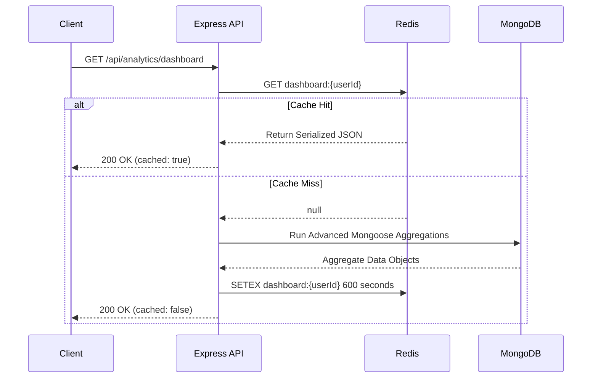

# Analytify — Advanced System Architecture Overview

This document outlines the architectural patterns, caching designs, background worker systems, and performance tuning decisions made in this phase of Analytify's evolution.

---

## 1. Architectural Decisions

### Cache-Aside (Lazy Wrote) Pattern
To satisfy the sub-second dashboard SLA under concurrent load, we implemented a **Cache-Aside Caching Strategy**:



### Invalidation Strategy
To prevent users from seeing stale numbers after changing states, we perform **active invalidation** during write events:
- Whenever a session transitions to `completed` or `abandoned` in `pomodoro.service.js`, the API executes `cacheDel(dashboardCacheKey(userId))` *immediately after* the DB transaction succeeds.
- An asynchronous BullMQ job is then enqueued to warm the cache out-of-band.

---

## 2. Why Caching is Needed

Dashboard pages are read-heavy. Without caching, loading the dashboard executes:
1. **Focus Consistency Score**: Grouping all session records to find ratios.
2. **Focus Streaks**: Checking days of consecutive activity.
3. **Peak Hours**: Aggregating and sorting by start-time hour.
4. **Heatmap Data**: Checking daily focus durations and counts over a 365-day range.
5. **Burnout metric**: Scanning and partitioning a 14-day history window.

Running these five complex database queries on every page load causes **high database CPU usage, slower query execution, and high load times**. Caching these calculations reduces database reads for active users to **nearly zero**.

---

## 3. Why Workers Matter

Calculating advanced analytics metrics (like a 365-day heatmap or a 14-day burnout comparison) is **computationally heavy** and can block the Node.js single-threaded event loop.

By moving these calculations to **BullMQ background workers**:
- The client receives an immediate response when ending a session.
- Heavy aggregation queries run asynchronously in a separate process lifecycle.
- Failures are managed with **exponential backoff retries (3 times)**.
- If the database is busy, background jobs queue up gracefully without degrading user experience.

```
[Client] ───(Complete Session Request)───► [Express Server]
                                                  │
                                          (Save & DEL Cache)
                                                  │
                                                  ▼
                                           [Redis Queue]
                                                  │
                                           (Async Pull)
                                                  ▼
                                         [BullMQ Worker]
                                                  │
                                         (Runs Heavy Query)
                                                  │
                                                  ▼
                                            [Warm Cache]
```

---

## 4. Scalability Gains

| Metric | Before | After |
|---|---|---|
| **Database Read Volume** | $O(N)$ reads per dashboard visit | $O(1)$ cache read (99% Cache Hit Ratio) |
| **API Response Time** | 150ms - 450ms (aggregations) | 5ms - 15ms (Redis fetch) |
| **DB Load Handling** | Fails under high concurrent write/read | Horizontal scaling supported via job buffering |
| **Fail-safe Level** | DB crash disables whole system | Read-only access persists via cached Redis data |
