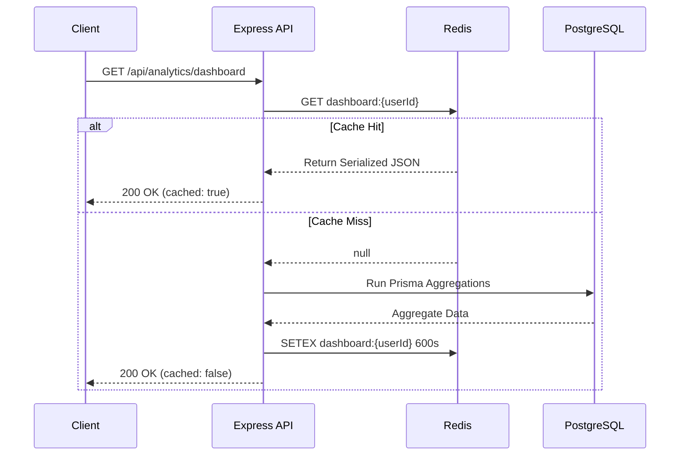

# Analytify

**Turn every focus session into honest, checkable evidence of how you actually work.**

Analytify is a full-stack Pomodoro/focus-tracking app that goes past "timer + streak count." It computes a Deep Work Score, a burnout signal, and consistency metrics from real session data — and layers an agentic AI coach on top that can plan, act, reflect on its own progress, and pause for human approval before taking consequential actions.

Live: [analytify.vercel.app](https://analytify.vercel.app) · Backend: [Render](https://render.com)

### 🛠️ Tech Stack

<p>
  
  
  
  
  
</p>
<p>
  
  
  
  
  
</p>
<p>
  
  
  
  
  
</p>

---

## Why this exists

Most productivity timers are dumb — they track time but never tell you if the time meant anything. Most "AI-powered" versions go the other way: bolt a chatbot on top and call it done, with the entire product going dark the moment the API key does.

Analytify is built so that **100% of the core product works with zero AI dependency** — auth, sessions, streaks, burnout scoring, goals, work journal, public profiles — and the AI layer is a genuinely separate, additive system on top of it, not the thing holding the app together. Where the AI *does* touch a well-defined feature (like a daily check-in nudge), it degrades gracefully to a deterministic, rule-based answer instead of failing outright.

## Features

### Core (no AI required)
- **Pomodoro sessions** with pause/resume/abandon lifecycle tracking
- **Deep Work Score** — weighted by session length, interruption count, and day-to-day consistency
- **Burnout signal** — a real score + risk level, not a vibe, computed from completion-rate trends
- **Streaks with freeze tokens** — a missed day doesn't zero out a long streak; freeze tokens are earned, not free
- **365-day focus heatmap**
- **Goals with linked evidence** — goals aren't just checkboxes; every goal shows the actual work-log entries proving progress
- **Public shareable profile** (`/u/:username`) with a GitHub-README-style embeddable streak badge
- **Rule-based session planner** — suggests session length/timing from your own burnout and peak-hour data, no model call involved

### Agentic AI layer (Groq-backed, degrades gracefully)
- **Tool-calling coach** — a chat assistant that can actually create tasks/goals, log work, capture notes, and recall past notes on your behalf, not just answer questions
- **Real planning + reflection** — before acting, the agent states an explicit plan; after each round of tool calls, it judges its own progress against that plan rather than looping on a fixed counter
- **Human-in-the-loop approval** — implemented as a LangGraph state graph with a checkpointed interrupt: creating a goal pauses the agent mid-turn and waits for an explicit Approve/Reject before anything is written
- **Graceful degradation** — the daily check-in and memory-note capture both have deterministic, non-AI fallbacks that use the same underlying data, so a missing/expired API key degrades the experience instead of breaking it

## Architecture

**Backend:** Node.js, TypeScript (strict), Express 5, Prisma 7 + PostgreSQL (Neon), Redis (Upstash) for caching, BullMQ for background jobs, `@langchain/langgraph` for the agent state machine, Groq for LLM inference.

**Frontend:** React 19, Vite, Tailwind CSS 4, Framer Motion, Recharts.

Layered consistently across all 17 backend modules: **controller → service → repository**, with a centralized error-class hierarchy and one error middleware — not the more common pattern of validation/business-logic/query code all bleeding into one file.

### Cache-aside dashboard reads

Dashboard analytics (heatmap, streak, burnout, peak hours) are expensive aggregations run against 365 days of session history. Rather than recompute them on every page load:


```mermaid
sequenceDiagram
    participant User as Client
    participant API as Express API
    participant Cache as Redis
    participant DB as PostgreSQL

    User->>API: GET /api/analytics/dashboard
    API->>Cache: GET dashboard:{userId}
    alt Cache Hit
        Cache-->>API: Return Serialized JSON
        API-->>User: 200 OK (cached: true)
    else Cache Miss
        Cache-->>API: null
        API->>DB: Run Prisma Aggregations
        DB-->>API: Aggregate Data
        API->>Cache: SETEX dashboard:{userId} 600s
        API-->>User: 200 OK (cached: false)
    end
```

Cache invalidation is active, not just TTL-based: any session transition to `completed`/`abandoned` deletes the dashboard cache key immediately after the write commits, then enqueues a BullMQ job to warm it back up out-of-band — so the next real page load doesn't pay the full aggregation cost either.

### Agentic chat as an explicit state graph

The AI coach's control flow isn't a flat loop with a round counter — it's a LangGraph `StateGraph` with real nodes and conditional edges:

```
plan → act → (needs approval?) → approveGoals → reflect → (sufficient?) → finalize
                    ↓ no                              ↓ no
                 reflect ───────────────────────────→ act (loop)
```

- **`plan`** — one call, before any tool use, that decides what the request actually needs (or explicitly decides nothing is needed)
- **`act`** — executes proposed tool calls; anything requiring approval (currently `create_goal`) is held back rather than run
- **`approveGoals`** — a real LangGraph `interrupt()`, checkpointed to Postgres — the graph's execution state is persisted and the HTTP request can return a "pending approval" response, resumed later by a separate request
- **`reflect`** — judges progress against the stated plan, not just "did a tool run" — this is what actually decides when the loop ends, with a hard round cap only as a safety net behind it

## Setup

### Prerequisites
- Node.js 22+
- PostgreSQL database (e.g. [Neon](https://neon.tech), free tier works)
- A [Groq API key](https://console.groq.com) (free tier, no credit card) — optional; see [AI resilience](#ai-resilience) below
- Redis (e.g. [Upstash](https://upstash.com)) — optional, caching/queues degrade gracefully without it

### Backend
```bash
cd backend
cp .env.example .env   # fill in DATABASE_URL at minimum
npm install
npx prisma generate
npx prisma migrate deploy
npm run dev             # http://localhost:5000
```

### Frontend
```bash
cd frontend
cp .env.example .env    # defaults to http://localhost:5000/api
npm install
npm run dev              # http://localhost:5173
```

### Tests & CI
```bash
cd backend
npm test          # vitest — schema validation, agent routing logic, rule-based fallbacks
npm run typecheck # tsc --noEmit
```
Both run in GitHub Actions on every push/PR touching `backend/` (`.github/workflows/backend-ci.yml`).

## AI resilience

The app runs fully without `XAI_API_KEY` configured — every core feature (sessions, streaks, scoring, goals, work journal, public profiles) has zero AI dependency, and the two AI-adjacent features that *can* degrade do so deterministically instead of failing:

| Feature | Without AI |
|---|---|
| Daily check-in nudge | Falls back to a templated message using the same burnout/streak/stale-task data, same priority order the AI prompt follows |
| Memory note capture | Falls back to a manual category picker against the same database, instead of losing the note |
| Chat coach, weekly review, learning path generation | These are inherently generative — no rule-based substitute is honest, so they show a clear error instead of pretending to work |

Rate limiting (`express-rate-limit`, tiered by endpoint sensitivity) and request validation (`zod`, at the route boundary) are applied globally, not just on AI routes.

## Project structure

```
backend/
  src/modules/<feature>/
    <feature>.routes.ts       # HTTP layer, validation, rate limits
    <feature>.controller.ts   # thin request/response glue
    <feature>.service.ts      # business logic
    <feature>.repository.ts   # Prisma queries
    <feature>.schema.ts       # zod validation (where applicable)
frontend/
  src/pages/                  # route-level views
  src/components/             # shared UI (ui.jsx is the design-token source of truth)
  src/features/<feature>/     # feature-scoped hooks + API clients
```
